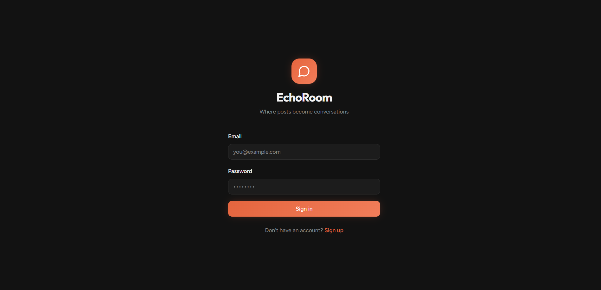
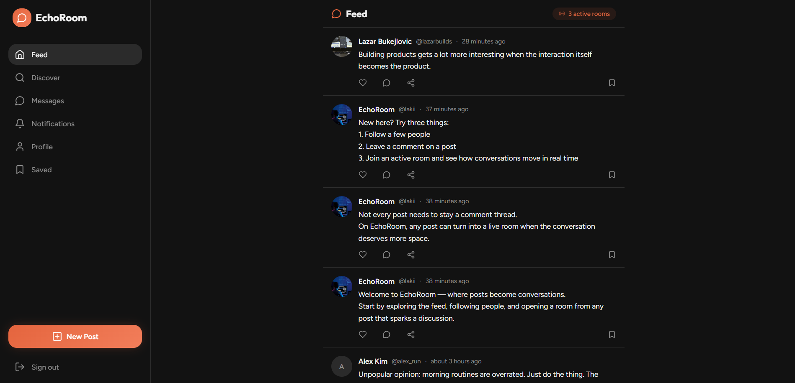
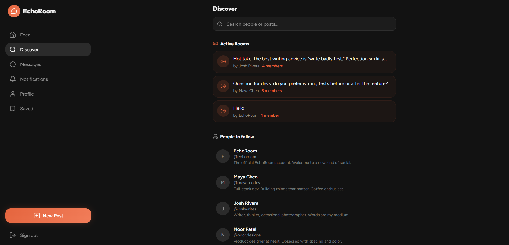
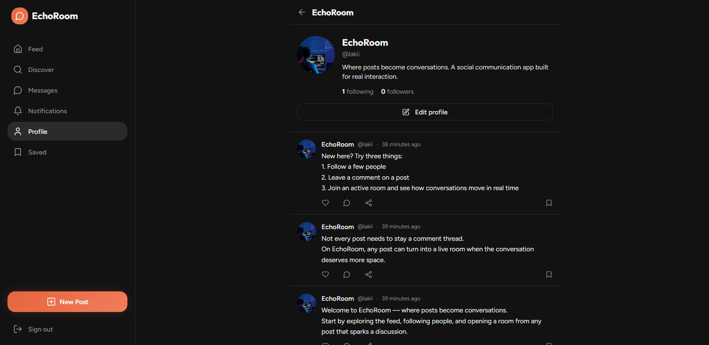

# EchoRoom

A social communication app where posts become conversations.

## Live Demo

## [Live App](https://echo-room-teal.vercel.app/)
## [Repository](https://github.com/lazarbukejlovic/echo-room)

---

## Overview

EchoRoom is a social communication product built around a simple idea: not every conversation should stay buried in comments or isolated inside private chat.

Users can create profiles, publish posts, react, comment, send direct messages, discover other people, and open live conversation rooms from posts that deserve deeper discussion. The result is a product that sits somewhere between a social feed and a real-time communication app rather than copying a single existing platform.

This project was built to feel like a real product, not just a portfolio demo. The focus was on interaction, product identity, usability, and full-stack behavior that remains consistent across auth, refresh, and repeated use.

---

## Why I Built It

Most portfolio projects in this space usually go in one of two directions: generic social clones or generic dashboard/business apps.

EchoRoom was built to avoid both.

I wanted to create a project that feels alive, user-facing, and communication-driven while still showing serious technical ability. Instead of building another simple feed or another simple chat, I focused on the connection between the two: turning posts into live conversations.

That made EchoRoom a stronger portfolio project for demonstrating:

- modern frontend execution
- social UX patterns
- real-time interaction
- backend persistence
- product thinking beyond generic templates

---

## Core Idea

**Posts can become rooms.**

That is the main product differentiator.

A user can publish a post, others can react and comment, and that interaction can evolve into a live room for deeper discussion. This makes the product more dynamic than a standard social feed and more contextual than a standalone messaging app.

EchoRoom is designed to feel like a product people could actually use, not just a screen-level concept.

---

## Features

### Social Feed
- Public feed with seeded social content
- Text and image-style post support
- Reactions / likes
- Comment threads
- Saved posts
- Time-based activity feel

### Profiles
- User profiles
- Avatar, username, and bio
- Follow / unfollow
- Personal post feed
- Strong social-product feel instead of a static user page

### Discover
- Search people and posts
- Suggested people to follow
- Active rooms visibility
- Better content density for exploration

### Messaging
- Direct message support
- Clean chat-first interface
- Better communication layer beyond feed interaction

### Conversation Rooms
- Posts can open into live rooms
- Room-based discussion tied to content
- More structured communication flow than a standard comment section
- Strongest product differentiator inside the app

### Notifications
- Social interaction awareness
- Better sense of product activity and user-to-user flow

### Auth & Persistence
- Sign up
- Sign in
- Sign out
- Session persistence
- Functional backend behavior after refresh and repeated sign-in
- Stable auth flow across app usage

---

## What This Project Demonstrates

EchoRoom was designed to show more than styling or simple CRUD.

It demonstrates:

- frontend-focused full-stack product development
- profile / feed / message architecture
- social interaction patterns
- real-time communication concepts
- user-driven content flows
- backend persistence
- auth reliability
- stronger product judgment and interaction design
- the ability to build something that feels different from generic portfolio apps

---

## Tech Stack

- **React**
- **TypeScript**
- **Tailwind CSS**
- **Supabase**
- **PostgreSQL**
- **Realtime functionality**
- **Authentication**
- **Storage / media-ready structure**

---

## Product Direction

EchoRoom is intentionally different from business dashboards and admin-style apps.

The goal was to create a product that feels:

- social
- interactive
- communication-first
- visually alive
- more consumer-facing
- more product-native
- less corporate / template-driven

That made it a valuable addition beside more structured business-oriented full-stack projects.

---

## Screenshots
### Auth


### Feed


### Discover


### Profile



## Local Setup

```bash
npm install
npm run dev
```

If environment variables are required, add them before starting the project.

---

## Project Structure

```bash
src/
  components/
  pages/
  hooks/
  integrations/
  lib/
  styles/
```

---

## What I Focused On

While building EchoRoom, I focused on:

- making the product feel alive after entering it
- avoiding the “empty demo app” feeling
- creating a more natural social content flow
- building interaction between feed and communication
- keeping the app visually distinct from generic SaaS-style portfolio projects
- preserving working backend/auth flows instead of faking functionality

---

## Future Improvements

Possible next steps for EchoRoom:

- richer media handling
- stronger DM experience
- group messaging
- deeper room controls
- richer search and discover logic
- better notification preferences
- more advanced profile customization

---

## Final Note

EchoRoom was built to feel like a real product rather than a generic portfolio exercise.

The goal was not only to make something work, but to make something that feels usable, alive, and interesting to explore — while still showing solid technical depth through authentication, persistence, communication flow, and social interaction patterns.
